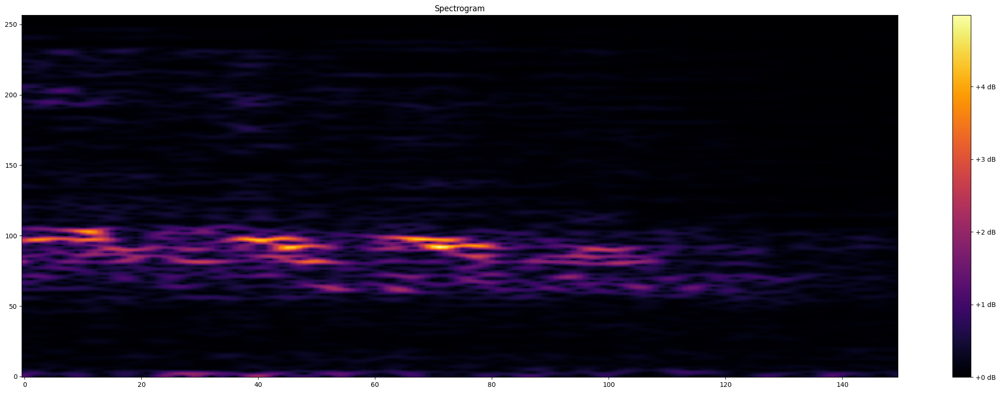

# ChirpDetect 🐦
**ChirpDetect** is an interactive bird sound classification app built using Streamlit, leveraging Convolutional Neural Networks (CNNs) to provide users with insights into identifying various bird species based on their calls. The app allows users to visualize results, analyze audio input, and classify bird sounds in real-time.

## 📋 Table of Contents
1. [Overview](#overview)
2. [Demo](#demo)
3. [Data Collection Process](#data-collection-process)
4. [Data Preprocessing](#data-preprocessing)
5. [Model Building](#model-building)
6. [App Features](#app-features)

## 📘 Overview
**ChirpDetect** is an interactive bird sound classification app built with Streamlit and powered by Convolutional Neural Networks (CNNs) to help users identify bird species from their calls. The app allows users to upload recordings and then classifies the bird sounds in real time. By leveraging TensorFlow for the machine learning model, Librosa for audio processing, and Plotly for visualization, the app provides a seamless and informative user experience.

The project is built using locally recorded bird call samples from the surrounding area [located here](https://maps.app.goo.gl/45fe6eRNAD3a4nrz6). Due to the limited number of available recordings, **data augmentation** techniques were applied to enhance the dataset. Methods such as time-stretching, pitch-shifting, and adding background noise helped simulate various real-world scenarios. This allowed the model to generalize better and perform effectively, even with the small dataset, by creating a more diverse and robust set of training samples.


## 🌐 Demo
Check out the live demo of the app here: [ChirpDetect - Bird Sound Classification App](https://chirpdetect.streamlit.app). To facilitate your testing, we have provided two sample audio files, each containing various bird calls along with their respective counts:

1. **[indian_forest_1.mp3](Test_Sammple/indian_forest_1.mp3)**
   - **Bird Counts:**
     - Collared Dove: 14
     - Indian Myna: 7
     - Kingfisher: 23
     - Nightingale: 22
     - Owl: 7
     - Sparrow: 1
     - Unknown: 29

2. **[indian_forest_2.mp3](Test_Sammple/indian_forest_2.mp3)**
   - **Bird Counts:**
     - Collared Dove: 6
     - Kingfisher: 7
     - Nightingale: 5
     - Owl: 19
     - Unknown: 7

Feel free to download these audio clips and upload them to the app to test its performance in classifying different bird species based on their sounds!

## 📈 Data Collection Process

To build the bird sound classification model, local bird species were recorded to gather as many samples as possible. The following species, commonly found in the area, were captured:

- [Indian Myna](https://en.wikipedia.org/wiki/Common_myna)
- [Collared Dove](https://en.wikipedia.org/wiki/Eurasian_collared_dove)
- [Kingfisher](https://en.wikipedia.org/wiki/Kingfisher)
- [Owl](https://en.wikipedia.org/wiki/Owl)
- [Sparrow](https://en.wikipedia.org/wiki/House_sparrow)
- [Nightingale](https://en.wikipedia.org/wiki/Common_nightingale)

These recordings were captured from the region [located here](https://maps.app.goo.gl/45fe6eRNAD3a4nrz6). However, due to the limited number of recordings, **data augmentation** techniques were used to increase the size and diversity of the dataset. Augmentation was performed by applying transformations like pitch shifting, time-stretching, and adding background noise, simulating different environments and variations in bird calls.

Here’s the augmentation function used to enhance the dataset:

```python
import os
import librosa
import soundfile as sf
import numpy as np

# Define paths
input_dir = 'processed_data'
output_dir = 'augmented_data'

# Create output directory if it doesn't exist
os.makedirs(output_dir, exist_ok=True)

# Function to augment audio
def augment_audio(audio):
    # Augmentation techniques
    # 1. Pitch shift
    n_steps = np.random.randint(-2, 3)  # Random pitch shift steps
    pitch_shifted = librosa.effects.pitch_shift(audio, sr=sr, n_steps=n_steps)

    # 2. Time stretch
    stretch_factor = np.random.uniform(0.8, 1.2)  # Time stretch between 80% and 120%
    stretched = librosa.effects.time_stretch(audio, rate=stretch_factor)

    # 3. Add noise
    noise = np.random.randn(len(audio)) * 0.005  # Adjust noise level as needed
    noisy_audio = audio + noise

    return [pitch_shifted, stretched, noisy_audio]

# Iterate through each class folder and augment audio files
for class_folder in os.listdir(input_dir):
    class_path = os.path.join(input_dir, class_folder)
    if os.path.isdir(class_path):
        # Create a folder for the class in the output directory
        class_output_path = os.path.join(output_dir, class_folder)
        os.makedirs(class_output_path, exist_ok=True)

        # Initialize a counter for samples
        sample_count = 0

        # Process each audio file in the class folder
        for audio_file in os.listdir(class_path):
            if audio_file.endswith('.wav'):
                input_file_path = os.path.join(class_path, audio_file)
                audio, sr = librosa.load(input_file_path, sr=None)

                # Generate augmented samples until we reach 150 samples
                while sample_count < 150:
                    augmented_samples = augment_audio(audio)

                    # Save each augmented sample
                    for idx, sample in enumerate(augmented_samples):
                        output_file_name = f"{class_folder}_{audio_file.split('.')[0]}_sample{sample_count + 1}_aug{idx + 1}.wav"
                        output_file_path = os.path.join(class_output_path, output_file_name)
                        sf.write(output_file_path, sample, sr)
                        
                    sample_count += len(augmented_samples)

                # Reset sample count for the next file
                sample_count = 0

print("Audio augmentation completed with 150 samples per class.")

```
By augmenting the data, the model is better equipped to handle real-world variations in bird calls, despite having a limited number of original samples.

## 🧹 Data Preprocessing

The preprocessing steps in this project involve converting raw audio data into spectrograms, a visual representation of the audio signals in the frequency domain. Two key functions are used for this purpose:

1. **`load_wav_16k_mono(filename)`**: This function loads the audio file and converts it into a 16 kHz mono-channel format using the `librosa` library. It ensures consistency in the data format by down-sampling and making all audio files single-channel.

2. **`preprocess(file_path)`**: This function takes the audio file path as input, converts it into a spectrogram using Short-Time Fourier Transform (STFT), and ensures it has a fixed size by either padding or cropping.

Here’s the code for these functions:

```python
import librosa
import soundfile as sf

def load_wav_16k_mono(filename):
    # Load the audio file using librosa
    wav, sample_rate = librosa.load(filename, sr=16000, mono=True)
    
    # Convert the wav to a mono channel if it’s not already
    if wav.ndim > 1:
        wav = librosa.to_mono(wav)
        
    return wav

def preprocess(file_path):
    # Load the audio file and convert to a mono channel
    wav = load_wav_16k_mono(file_path)
    
    # Compute the STFT of the audio signal
    spectrogram = tf.signal.stft(wav, frame_length=320, frame_step=32)
    
    # Take the absolute value of the STFT to get the magnitude spectrogram
    spectrogram = tf.abs(spectrogram)
    
    # Add the channel dimension to make the spectrogram 3D (height, width, channels)
    spectrogram = tf.expand_dims(spectrogram, axis=-1)  # Shape becomes (time, frequency, 1)
    
    # Ensure fixed size by padding or truncating (150 time steps, 257 frequency bins, 1 channel)
    desired_shape = (150, 257, 1)
    spectrogram = tf.image.resize_with_crop_or_pad(spectrogram, desired_shape[0], desired_shape[1])
    
    return spectrogram
```

### Example Spectrograms

Below are a few sample spectrograms generated from the bird call audio data:

Collared Dove:


Kingfisher:


Owl:


Above are the representations of bird calls in the form of images. The spectrograms showcase the intensity of frequencies over time, which are crucial for training the machine learning model in detecting bird species based on their sounds.

## 🧠 Model Building

The classification of bird species based on their sounds is achieved through a Convolutional Neural Network (CNN). CNNs are ideal for tasks involving image recognition and processing, and since our spectrograms are essentially 2D representations of audio data, CNNs are a natural fit for this task. Below is the model structure and detailed explanation:

```python
# Define the model
model = Sequential([
    Input(shape=(X_train.shape[1], X_train.shape[2], 1)),  # Input shape of spectrograms (height, width, channels)

    # First convolutional block
    Conv2D(32, (3, 3), activation='relu'),  # 32 filters, kernel size 3x3, ReLU activation for non-linearity
    BatchNormalization(),                   # Batch normalization to stabilize learning and improve performance
    MaxPooling2D((2, 2)),                   # Max pooling with a 2x2 filter to reduce the spatial dimensions

    # Second convolutional block
    Conv2D(64, (3, 3), activation='relu'),  # 64 filters for deeper feature extraction
    BatchNormalization(),
    MaxPooling2D((2, 2)),

    # Third convolutional block
    Conv2D(128, (3, 3), activation='relu'),  # 128 filters to capture complex patterns in the spectrogram
    BatchNormalization(),
    MaxPooling2D((2, 2)),

    # Global Average Pooling layer
    GlobalAveragePooling2D(),  # Reduces the feature map size to a single vector by averaging the data across the feature map

    # Dense layer for classification
    Dense(128, activation='relu'),   # Fully connected layer with 128 units and ReLU activation
    Dropout(0.5),  # Dropout to prevent overfitting by randomly turning off 50% of neurons during training

    # Output layer for multi-class classification
    Dense(len(BIRD_CLASSES), activation='softmax')  # Softmax activation to output probabilities for each bird class
])

# Compile the model
model.compile(optimizer='adam', loss='sparse_categorical_crossentropy', metrics=['accuracy'])  # Adam optimizer and sparse categorical crossentropy for multi-class classification

# View the model summary
model.summary()
```

#### **Explanation of the Model Architecture:**

1. **Input Layer**: The model takes spectrogram images as input. Each spectrogram is represented as a 3D matrix (height, width, channels), where the first two dimensions represent time and frequency, and the last dimension represents the channel (since these are grayscale images, the channel size is 1).

2. **First Convolutional Block**:
    - **Conv2D Layer**: The model starts with a convolutional layer having 32 filters with a kernel size of 3x3. This layer extracts features such as edges, shapes, and patterns from the spectrogram.
    - **BatchNormalization**: Normalizes the activations of the previous layer to improve training stability and speed.
    - **MaxPooling2D**: Reduces the spatial dimensions (height and width) by taking the maximum value from each 2x2 block, which helps in downsampling and reducing computational complexity.

3. **Second Convolutional Block**:
    - **Conv2D Layer**: In this block, the number of filters is increased to 64, allowing the network to capture more complex patterns from the spectrogram.
    - **BatchNormalization**: Applied again for normalization.
    - **MaxPooling2D**: Further reduces the spatial dimensions.

4. **Third Convolutional Block**:
    - **Conv2D Layer**: The filter size is increased to 128, enabling the model to learn high-level features. This helps in distinguishing between subtle differences in bird calls.
    - **BatchNormalization** and **MaxPooling2D**: These are applied once more to maintain stability and further reduce the dimensions.

5. **Global Average Pooling**: This layer converts the 2D feature maps from the final convolutional layer into a single 1D vector by averaging all values in the feature maps. This reduces the data size while retaining key information.

6. **Fully Connected Layers**:
    - **Dense Layer (128 units)**: This layer connects all neurons to the previous layer's output. It uses ReLU activation to introduce non-linearity, allowing the network to learn more complex relationships between features.
    - **Dropout Layer**: To prevent overfitting, the dropout layer randomly disables 50% of the neurons during training. This ensures that the model does not memorize the training data and can generalize well to new, unseen data.

7. **Output Layer**:
    - **Dense Layer (len(BIRD_CLASSES))**: The final layer has as many units as the number of bird species classes (`len(BIRD_CLASSES)`), using a **softmax** activation function. Softmax ensures that the output is a probability distribution over the classes, making it suitable for multi-class classification.

8. **Model Compilation**:
    - **Optimizer**: The **Adam** optimizer is used for updating the weights, known for its efficiency and ability to handle sparse gradients.
    - **Loss Function**: **Sparse categorical crossentropy** is chosen as the loss function because it is ideal for multi-class classification problems where the target variable is an integer (each bird class corresponds to a unique integer).
    - **Metrics**: The model is evaluated using **accuracy** to track its performance during training and testing.

This CNN architecture is highly effective in learning the unique features from the spectrograms of different bird calls, enabling the model to classify bird species accurately based on sound data. The combination of convolutional layers for feature extraction, pooling layers for dimension reduction, and fully connected layers for decision-making makes this model robust for the bird sound classification task.


### 🛠️ App Features

This section describes the key features of the **ChirpDetect** app. The app allows users to upload an audio file (either in MP3 or WAV format) and classify bird species based on the sounds within the file. The classification is achieved through a pre-trained model that processes the audio into 3-second clips and identifies bird calls from the dataset. Below is the full app UI, along with a description of the important features and the code.

#### **App UI Overview**

- The **ChirpDetect** app has a clean and user-friendly interface. Users can upload audio files, and the app displays the detected bird species and their counts in the uploaded audio file. The app also includes a visual pie chart representation of bird occurrences.
  
#### **File Upload and Bird Count Table**

- The file upload section allows users to browse and select audio files from their system.
- Once the file is uploaded, the app segments the audio into 3-second clips, classifies bird species in each clip, and displays a table with the count of occurrences for each bird class. 

#### **Plotly Pie Chart**

- The pie chart shows the relative density of different bird species found in the audio clip. The chart provides a visual representation of the bird occurrences and highlights the dominant species in the recording.

### 🔍 **App Code**:
Here’s the full code used to implement the app:

```python
import streamlit as st
import numpy as np
import librosa
import os
import tensorflow as tf
import plotly.express as px
import pandas as pd

# paths to the dataset
DATA_DIR = 'augmented_data'  
BIRD_CLASSES = ['collared_dove', 'indian_mayna', 'kingfisher', 'nightingale', 'owl', 'sparrow', 'unknown', 'noise']

# Load the trained model
model = tf.keras.models.load_model('bird_classification_model.h5')

def load_wav_16k_mono(filename):
    wav, sample_rate = librosa.load(filename, sr=16000, mono=True)
    return wav

def preprocess(wav):
    # Compute the Short-Time Fourier Transform (STFT)
    spectrogram = tf.signal.stft(wav, frame_length=320, frame_step=32)
    spectrogram = tf.abs(spectrogram)
    spectrogram = tf.expand_dims(spectrogram, axis=-1)  # Add channel dimension
    desired_shape = (150, 257, 1)  # Desired input shape
    spectrogram = tf.image.resize_with_crop_or_pad(spectrogram, desired_shape[0], desired_shape[1])
    return spectrogram

def classify_birds(audio_clips):
    counts = {bird_class: 0 for bird_class in BIRD_CLASSES if bird_class != 'noise'}
    for clip in audio_clips:
        clip_input = preprocess(clip)  # Preprocess the clip
        clip_input = np.expand_dims(clip_input, axis=0)  # Add batch dimension
        prediction = model.predict(clip_input)
        predicted_class_index = np.argmax(prediction)
        predicted_class = BIRD_CLASSES[predicted_class_index]
        if predicted_class != 'noise':
            counts[predicted_class] += 1
    return counts

st.title("ChirpDetect 🐦")

uploaded_file = st.file_uploader("Upload an audio file (MP3 or WAV)", type=['mp3', 'wav'])

if uploaded_file:
    with open("temp_audio.wav", "wb") as f:
        f.write(uploaded_file.getbuffer())
        
    # Load the uploaded audio file
    audio, sr = librosa.load("temp_audio.wav", sr=None)
    clip_length = 3  # 3 seconds
    num_clips = int(len(audio) // (clip_length * sr))
    audio_clips = [audio[i * clip_length * sr:(i + 1) * clip_length * sr] for i in range(num_clips)]
    
    # Classify the birds
    counts = classify_birds(audio_clips)

    # Filter out categories with zero occurrences and noise
    filtered_counts = {key: value for key, value in counts.items() if value > 0}

    # Convert counts to DataFrame for better table format
    if filtered_counts:
        counts_df = pd.DataFrame(filtered_counts.items(), columns=['Bird Class', 'Count'])
        counts_df['Count'] = counts_df['Count'].astype(int)  # Ensure counts are integers

        # Display the counts in a styled DataFrame
        st.subheader("Bird Class Counts")
        st.dataframe(counts_df.style.highlight_max(axis=0), use_container_width=True)  # Highlight max count in each column

    # Create a pie chart with Plotly
    if filtered_counts:
        fig = px.pie(names=list(filtered_counts.keys()), values=list(filtered_counts.values()),
                      title="Density of Birds in the Clip", hole=0.4)
        fig.update_layout(title_font_size=12)  
        fig.update_traces(textinfo='percent+label')  # Show percentage and label on pie chart
        st.plotly_chart(fig)
```

### 🎨 The **ChirpDetect** app features a user-friendly interface that allows users to upload MP3 or WAV audio files for bird classification. Once a file is uploaded, the app processes the audio using **librosa**, segmenting it into 3-second clips, which are then classified by a pre-trained model. The app counts the occurrences of each bird species detected in the audio and presents this data in a well-formatted table, highlighting the most frequent bird class. Additionally, a pie chart generated with **Plotly** visualizes the relative density of different bird species in the recording, providing an intuitive representation of the classification results. This combination of data presentation and visualization enhances the user experience, making it easy to interpret and understand the findings.
